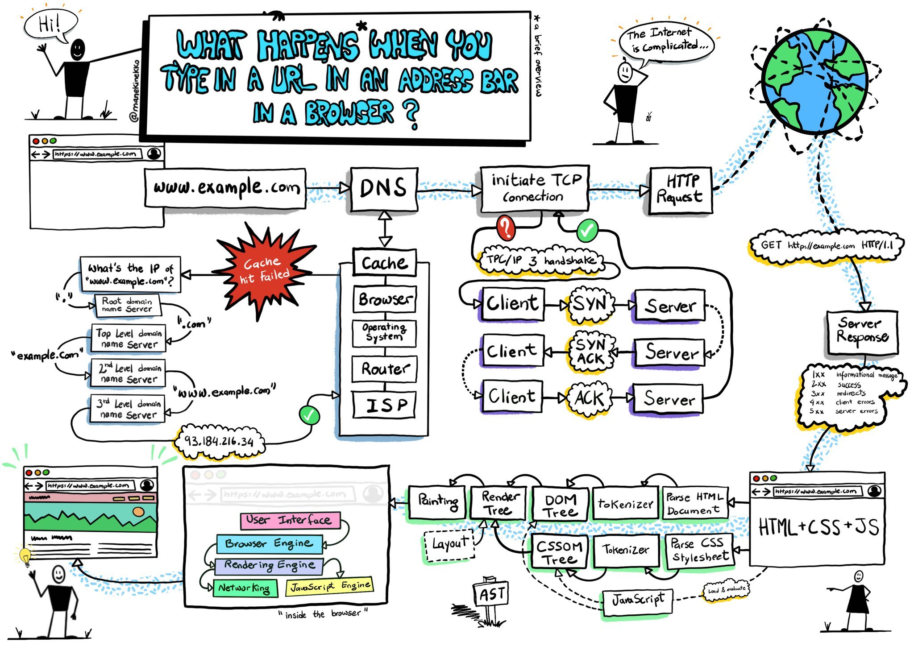
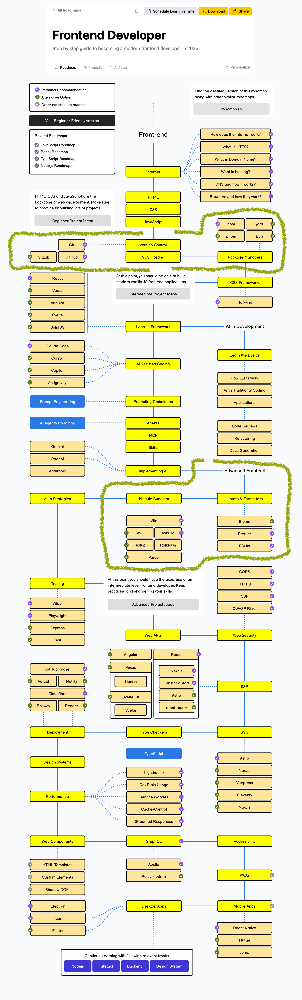
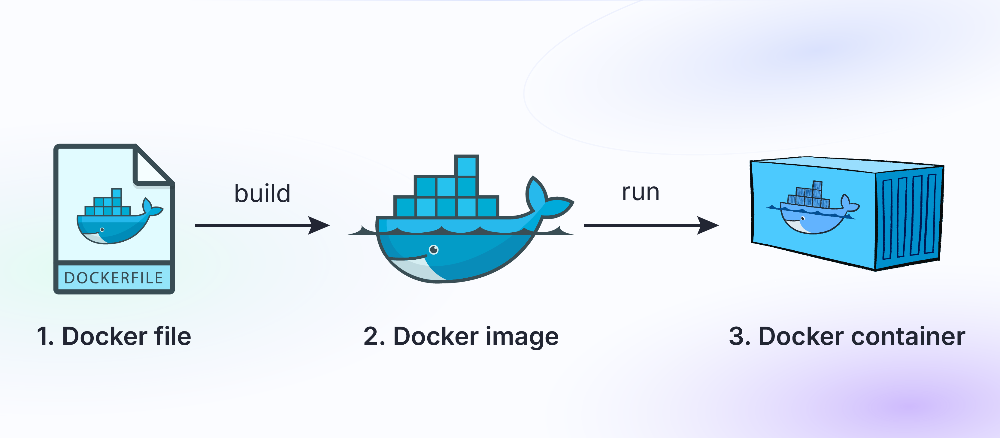
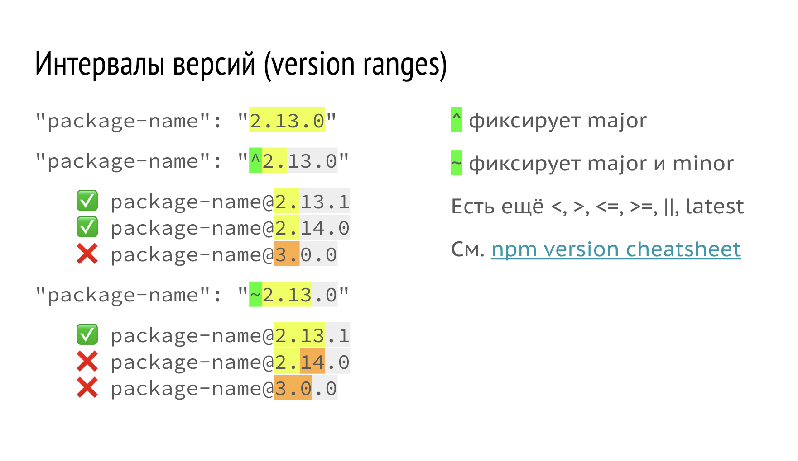
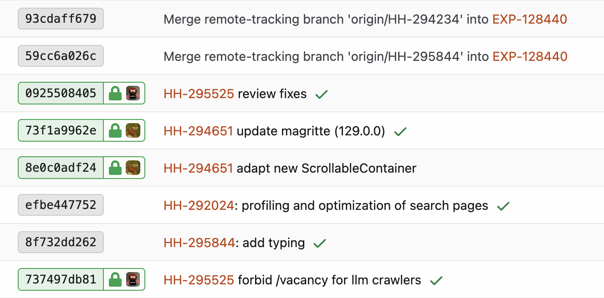

```                                                          


    (hh) 24-02-2026                            
    ▐▛▀▀▘▐▛▀▚▖▗▞▀▀▚▖▗▖  ▗▖▗▄▄▄▖▐▛▀▀▘▗▖  ▗▖▗▄▄▄ 
    ▐▙▄▄ ▐▌ ▐▌▐▌  ▐▌▐▛▚▖▐▌  █  ▐▙▄▄ ▐▛▚▖▐▌▐▌  █
    ▐▌   ▐▛▀▚▖▐▌  ▐▌▐▌ ▝▜▌  █  ▐▌   ▐▌ ▝▜▌▐▌  █
    ▐▌   ▐▌ ▐▌▝▚▄▄▞▘▐▌  ▐▌  █  ▐▙▄▄▖▐▌  ▐▌▐▙▄▄▀
                                 ИНФРАСТРУКТУРА

                                                          
```

😎 Иван Петропольский, команда «Монетизация», (hh)

✅ Камера

🚫 Микрофон

✅ Вопросы — голосом

📣 Вопросы в чате — кто последит?

☕️ Перерыв — если надо

💬 После лекции: чат ~frontend

🔴 Включена запись 👀


# Что за инфраструктура

Начнём издалека, для общего понимания:
- Кто мы? Веб-разработчики!
- Что мы делаем? Разрабатываем веб-сервисы!


## Page Load Lifecycle

В общем случае задача любого веб-сервиса:
- Отдать по запросу HTML, CSS, JS или медиа



Наш кусочек на этой схеме — `HTML + JS + CSS`.


### HTTP-запрос

- Метод: GET | POST | PUT | DELETE | ...
- URL: https://hh.ru/search/vacancy
- Параметры: `?areaId=1`
- Заголовки запроса (Accept, Cookie, ...)
- Тело запроса (опционально)

### Работа сервера

- Тут работает то, что накодил бэкенд

### Ответ сервера

- Статус (200 OK, 404 Not Found, ...)
- Заголовки ответа (Content-Type, Set-Cookie, ...)
- Тело ответа — то, что накодил фронтенд

> Демо


## Что вообще бывает в разработке

1) **Продуктовый код**             — ценность для пользователя
2) **Архитектура приложения**      — как всё связано между собой
3) **Дизайн-система, UI Kit**      — как всё выглядит и действует
4) **Тестовый слой**               — насколько правильно всё работает
5) **Аналитика и телеметрия**      — насколько всё живое
6) **Процессы разработки**         — как организована наша работа
7) **Документация, база знаний**   — как мы передаём знания
8) **Инфраструктура**              — как код становится продуктом


## Скучное определение (одно из)

Инфраструктура — это слой инструментов и автоматизаций,
который не виден пользователю, но делает возможной и удобной
разработку продукта.


## Путь фронтендера

https://roadmap.sh/frontend




# Инфраструктура фронтенда (и не только)

> ⛳️ – есть отдельная лекция, не будем углубляться


## ⚙️ Окружение

- Infrastructure as Code, IaC (Docker, Ansible) ⛳️
- Настройка терминала (интерпретатор, промпт, переменные)
- Shell-скрипты (sh, bash, zsh)
- Удалённый доступ и синхронизация (SSH)
- NodeJS, системы модулей (NodeJS)
- Управление зависимостями (npm, package.json, lock-файлы)
- Системы контроля версий (Git) ⛳️


## 💻 Проект

- Конфигурация проекта (dot-файлы, rc-файлы, env-переменные)
- Линтеры, форматтеры, тайп-чекеры (ESLint, Prettier, tsc)
- Обслуживающие скрипты (npm-scripts, git-хуки, утилиты)
- Системы сборки (Webpack, Vite, Rollup)
- CI/CD пайплайны проверки, ревью, сборки, деплоя (GitHub Actions) ⛳️
- Средства отладки (dev-server, source maps, html-to-source)
- Системы документирования (README, CHANGELOG, Storybook, OpenAPI)


## 👀 Инструменты разработки

- Для написания кода (IDE)
- Для генерации кода (агенты, скиллы, MCP, codegen-утилиты)
- Для хостинга и ревью кода (GitHub, BitBucket, Forgejo) ⛳️


---
```

  🟡 Окружение   
     🟡 Docker   ← мы тут
     ⚫️ Shell    
     ⚫️ Bash     
     ⚫️ SSH      
     ⚫️ NodeJS   
     ⚫️ NPM      
     ⚫️ Git      
  ⚫️ Проект      

```


```


                                                     
    ██████╗  ██████╗  ██████╗██╗  ██╗███████╗██████╗ 
    ██╔══██╗██╔═══██╗██╔════╝██║ ██╔╝██╔════╝██╔══██╗
    ██║  ██║██║   ██║██║     █████╔╝ █████╗  ██████╔╝
    ██║  ██║██║   ██║██║     ██╔═██╗ ██╔══╝  ██╔══██╗
    ██████╔╝╚██████╔╝╚██████╗██║  ██╗███████╗██║  ██║
    ╚═════╝  ╚═════╝  ╚═════╝╚═╝  ╚═╝╚══════╝╚═╝  ╚═╝
                                           Контейнеры

                                                     
```

# Docker — воспроизводимое окружение

https://www.docker.com/

- Контейнер = изолированное приложение + все его зависимости
- Окружение работает одинаково на любой машине
- Основа современной DevOps и CI/CD





## Dockerfile — инструкции для создания образа

Дока:
https://docs.docker.com/reference/dockerfile/

Примеры:
https://github.com/ipetropolsky/docker


## Демо

1) Собираем и запускаем контейнер.

2) Меняем Dockerfile:
```bash
# Просто пример команды, выполняемой при сборке
RUN echo 'echo "Hello, $(whoami)"!' >> /home/hh/.bashrc
```

3) Собираем и запускаем снова, видим "Hello, hh!".


## Запуск с готовым образом

https://hub.docker.com/ — реестр образов

```bash
# Запуск контейнера с NodeJS
docker run -dit --name n1 node

# С кириллицей и монтированием папки внутрь
docker run -dit \
  -e LANG='C.UTF-8' \
  -e LC_ALL='C.UTF-8' \
  --name n1 \
  -v $(pwd)/codebase:/home/node/codebase \
  node

# Список контейнеров
docker ps -a | grep n1

# Вход
docker exec -it n1 /bin/bash

# Ошибка, нет less
less /etc/os-release

# Установить пакет
apt-get update
apt-get install less

# Что за система (Debian)
less /etc/os-release

# Заходим под юзером node
su node

# Идём в home-папку, смотрим где мы, что вокруг
cd
pwd
ls -la  # видим codebase

# Пишем в codebase
echo 'Hello from n1' > codebase/hello.txt

# Выходим из юзера node (^D)
exit

# Выходим из контейнера (^D)
exit

# Можно локально закоммитить изменения в системе,
# (но не в подключённых папках)
docker commit n1 node-local

# Проверяем
docker images | grep local

# Теперь можно запустить другой контейнер (n2)
docker run -dit \
  -e LANG='C.UTF-8' \
  -e LC_ALL='C.UTF-8' \
  --name n2 \
  -v $(pwd)/codebase:/home/node/codebase \
  node-local

# Вход
docker exec -it n2 /bin/bash

# Ошибки нет, less установлен в образе
less /etc/os-release

exit

# Удалить созданный образ
docker rmi node-local
```


---
```

  🟡 Окружение   
     ✅ Docker   
     🟡 Shell    ← мы тут
     ⚫️ Bash     
     ⚫️ SSH      
     ⚫️ NodeJS   
     ⚫️ NPM      
     ⚫️ Git      
  ⚫️ Проект      

```


```

                                           
    Скрипты                                 
    ░██████   ░██                   ░██ ░██ 
  ░██    ░██  ░██                   ░██ ░██ 
  ░██         ░████████   ░███████  ░██ ░██ 
    ░██████   ░██    ░██ ░██    ░██ ░██ ░██ 
          ░██ ░██    ░██ ░█████████ ░██ ░██ 
  ░██     ░██ ░██    ░██ ░██        ░██ ░██ 
   ░███████   ░██    ░██  ░███████  ░██ ░██ 
                                            

                                            
```

# Shell, командная строка, CLI, терминал, консоль

## Shell

Интерпретатор команд:
```bash
# Введённых пользователем
echo $TERM  # xterm-256color

# Написанных в скриптах
source script.sh  # xterm-256color

# Указанных при запуске шелла
bash -c 'echo $TERM'  # xterm-256color
ssh host 'echo $TERM'  # dumb
```


## CLI (Command Line Interface)

Набор команд для шелла, антоним GUI (например, git)


## Командная строка (Command Line)

Интерактивный интерфейс для ввода команд:
- Промпт: команда


## Терминал (консоль)

Чёрное окно с командной строкой:
- Windows 11: WSL2 + Ubuntu + Windows Terminal
- Mac, Linux: просто системный терминал

> ❓ Кто на Windows?


## ChatGPT

```
    Шелл не требует человека.
    Он требует поток байтов с текстом команд.

    Человек — просто один из возможных источников этого потока.

    Красиво, если подумать. Почти минимализм.
```


## Варианты шелла (интерпретатора)

- `sh` — скорость и лёгкость за счёт функций
- `bash` — золотой стандарт, есть почти везде
- `zsh` — самый продвинутый, дефолт на Маках
- `ash`
- `dash`
- `ebash`
- `fish`
- ...

> ❓ Какой ненастоящий?


Текущий интерпретатор:
```bash
echo $0  # /bin/bash — путь к бинарнику
```


## Настройка командной строки

1) Переменные окружения (env-переменные):
- sh: `ENV=путь-к-файлу`
- bash: `~/.bashrc`
- zsh: `~/.zshrc`

> Демо

```bash
# Объявление переменных
FOO=bar
export FOO_EXPORT=bar

# Текущий шелл и скрипты в нём
echo $FOO  # bar

# Сабшелл
bash -c 'echo $FOO'  # пусто
bash -c 'echo $FOO_EXPORT'  # bar
```

2) Цветной терминал

3) Вывод контекста в промпте:
- Ветка git
- Статус предыдущей команды
- И ещё миллион вещей

4) Тюнинг истории

5) Алиасы для команд


Пример:
https://github.com/ipetropolsky/bash-setup

> Демо


### Настройка посерьёзнее

- https://ohmyz.sh/ (zsh)
- https://ohmyposh.dev/ (bash)
- https://starship.rs/ (all)


---
```

  🟡 Окружение   
     ✅ Docker   
     ✅ Shell    
     🟡 Bash     ← мы тут
     ⚫️ SSH      
     ⚫️ NodeJS   
     ⚫️ NPM      
     ⚫️ Git      
  ⚫️ Проект      

```


```

                                  
          ▄▄                ▄▄    
  ▄▄      ██                ██    
   ▀█▄    ████▄  ▀▀█▄ ▄█▀▀▀ ████▄ 
    ▄█▀   ██ ██ ▄█▀██ ▀███▄ ██ ██ 
  ▄█▀     ████▀ ▀█▄██ ▄▄▄█▀ ██ ██ 
                Автоматизируй это 

                                  
```

# Bash — Bourne Again SHell

- Самый популярный шелл
- Есть переменные, условия, циклы, функции
- Основа большинства CI/CD-скриптов и DevOps-инструментов

⚠️ Важно: не программируйте на bash (и вообще в консоли)


## Справка и отладка

- `--version`
- `--help`, `man`
- `--verbose`, `-v`
- `which`, `type`
- `echo`, `printf`
- Кавычки `'` без подстановки $
- Кавычки `"` с подстановкой $

```bash
node --version
npm --version
git --help
man grep

which node
type cd

echo $RANDOM

# Подставится результат команды и значение переменной (")
echo "Hello from $(uname), #$UID"!

# Команда и переменная НЕ подставятся (')
echo 'Hello from $(uname), #$UID'!

# В printf подстановки указываются явно,
# в том числе перевод строки: \n
printf "Hello from %s, #%s!\n" "$(uname)" $UID
printf 'Hello from %s, #%s!\n' "$(uname)" $UID
```


## Файлы и каталоги

- `~`, `.`, `..`, `/`
- `ls`, `cd`, `pwd`, `mkdir`
- `cp`, `mv`, `ln`, `rm`, `touch`

```bash
pwd
ls -la
mkdir -p src/components

cd src/components
touch component.tsx
mv component.tsx Component.tsx
cd ../..

cp .env.example .env
ln -s AGENTS.md CLAUDE.md
rm -rf dist
```


## Чтение и запись

- `stdin` (0)
- `stdout` (1)
- `stderr` (2)
- `/dev/null`
- `|`, `>`, `>>`, `2>&1`
- `cat`, `tail`, `head`
- `less` + поиск: `/`, выход `q`
- `vim` + база: `i`, `Esc`, выход `:q`

```bash
ls .  # cписок файлов в stdout
ls . | less  # список файлов в stdin less
ls . | wc -l  # количество файлов
ls . | grep .png  # список PNG
ls . | grep .png | wc -l  # количество PNG

ls bubu  # No such file or directory
ls bubu 2>/dev/null  # Пусто

echo 'NODE_ENV=development' > .env
echo 'API_URL=http://localhost:3000' >> .env

cat package.json
head -n 20 tsconfig.json
tail -f logs/dev.log

npm run build > build.log 2>&1
less build.log
```


## Поиск

- `find . -name "*.md"`
- `grep "текст" filename`
- `grep -r "текст" .`
- `grep -Eo '\$git[a-z0-9_]+' filename`

```bash
find . -name '*.ts'
find . -name '*.env*'

grep 'useEffect' src/App.tsx
grep -r 'TODO:' src

grep -REo 'process\.env\.[A-Z_]+' src
grep -REoh 'process\.env\.[A-Z_]+' src | sort -u
```


## Запуск и права

- `. filename`
- `source filename`
- `chmod`
- `chown`
- `sudo`

```bash
# Выполнить скрипт (может быть неисполняемым)
. ./scripts/env.sh
source .venv/bin/activate

# Выполнить с супер-правами
sudo ./evil-script-from-the-internet.sh

# Сделать исполняемым
chmod +x scripts/run_tests.sh

# Поменять владельца рекурсивно
sudo chown -R $USER:$USER node_modules
```


## Запросы

- `curl`
- `wget`

```bash
curl https://example.com
curl -v https://example.com

curl -X POST https://example.com/api \
     -H 'Content-Type: application/json' \
     -d '{"ping": true}'

curl -s https://example.com > example.html
curl -s https://example.com | grep -Eo '[a-z]+: ?#[a-z0-9]+'
```


## Управление

- Комбинирование команд: `&&`, `||`, `if`, `for`, `while`
- Автодополнение: `↑`, `Tab`, `^R`
- Перемещение в строке: `Alt` + `←/→`, `^A`, `^E`, `^U`, `^K`
- Отмена и выход: `^C`, `^D`

```bash
# Цепочки команд
npm run lint && npm run test
npm run build || echo 'Build failed'

# if
if [ -f .env ]; then
    echo '.env exists'
fi

# for
for f in src/*.ts; do
    echo $f
done

# Составная цепочка типа if-else
SCORE=$RANDOM && [ "$SCORE" -gt 16384 ] && echo "$SCORE: You win"! || echo "$SCORE: You lose"!
```


---
```

  🟡 Окружение   
     ✅ Docker   
     ✅ Shell    
     ✅ Bash     
     🟡 SSH      ← мы тут
     ⚫️ NodeJS   
     ⚫️ NPM      
     ⚫️ Git      
  ⚫️ Проект      

```


```

                                  
                        ██\       
     Удалённый доступ   ██ |      
     ███████\  ███████\ ███████\  
    ██  _____|██  _____|██  __██\ 
    \██████\  \██████\  ██ |  ██ |
     \____██\  \____██\ ██ |  ██ |
    ███████  |███████  |██ |  ██ |
    \_______/ \_______/ \__|  \__|
                                  
                                  
```

# SSH — Secure SHell (данные шифруются)

- Управление удалёнными компьютерами через терминал
- Передача и синхронизация данных
- Работает во всех OS, используется на каждом сервере

Авторизация:
1) По логину и паролю (только если разово)
2) По паре ключей:
  - Приватный ключ на локальной машине
  - Публичный ключ на удалённой
  - При каждом использовании ключа вводим пароль
3) SSH-агент: хранит ключи и использует при подключении
  - Вводим пароль один раз при добавлении ключа


```bash
# Подключение
ssh user@server

# Подключение с дебагом (видно используемые ключи и т.п.)
ssh -v user@server

# Проверка доступа на github
ssh -T git@github.com

# Список ключей в агенте
ssh-add -l

# Добавить ключ
ssh-add ~/.ssh/my_key_ed25519
```


## SSH-конфиг

`~/.ssh/config`:
```bash
Host ts32
  HostName ts32.pyn.ru
  User hh
  IdentityFile ~/.ssh/i.petropolsky

  # Если нужны ssh-ключи на удалённой машине
  # ForwardAgent yes

  # Если хост постоянно меняет IP
  # UserKnownHostsFile=/dev/null
  # StrictHostKeyChecking no

Host *.pyn.ru
  User hh
  IdentityFile ~/.ssh/i.petropolsky
```

Подключение к хосту из конфига:
```bash
ssh ts32

# Посмотреть конфиг
ssh -G ts32
```


## Синхронизация файлов

- `scp` для простых случаев
- `rsync` для сложных

```bash
# Копируем локальный файл на ts32
scp ./package.json ts32:~

# Копируем с ts32 в текущую папку локально
scp ts32:~/check_master_db.sh .

# Залить ./ в /var/www/app на сервере, исключив лишнее
rsync -av --delete \
    --exclude 'node_modules' \
    --exclude '.git' \
    --exclude 'dist' \
    ./ user@server:/var/www/app

# Залить только папку /dist
rsync -av --delete dist/ user@server:/var/www/app
```


---
```

  🟡 Окружение   
     ✅ Docker   
     ✅ Shell    
     ✅ Bash     
     ✅ SSH      
     🟡 NodeJS   ← мы тут
     ⚫️ NPM      
     ⚫️ Git      
  ⚫️ Проект      

```


```

                                                   
    ▄▄▄    ▄▄▄          ▄▄            ▄▄▄  ▄▄▄▄▄▄▄ 
    ████▄  ███          ██            ███ █████▀▀▀ 
    ███▀██▄███ ▄███▄ ▄████ ▄█▀█▄      ███  ▀████▄  
    ███  ▀████ ██ ██ ██ ██ ██▄█▀ ▄▄▄  ███    ▀████ 
    ███    ███ ▀███▀ ▀████ ▀█▄▄▄  ▀████▀  ███████▀ 
                                        JavaScript 
                                                   

```

# NodeJS — JavaScript вне браузера

- Основа npm и всей фронтенд-инфраструктуры
- Работает на движке V8 (тот же, что в Chrome)
- Даёт доступ к файлам, сети, процессам
- Бэкенд и SSR на том же языке, что и фронтенд

> ❓ Бэкенд VS SSR

```node
$ node

// Welcome to Node.js v25.6.1.
// Type ".help" for more information.

> console.log(`Hello, ${process.env.USER}!`);

Hello, ipetropolsky!
```


> ❓ Почему не Python, Go, Ruff?

NodeJS:
- npm
- Линтеры
- TypeScript
- Системы сборки
- dev-серверы
- Утилиты и скрипты
- Фронтенд + Бэкенд
- SSR

Другие рантаймы:
- Deno
- Bun (нет на Windows)


## `nvm` — менеджер версий NodeJS

https://github.com/nvm-sh/nvm

- Использует замену пути к бинарникам в `$PATH`
- Не требует `sudo`

Установка:
```bash
# Из доки https://github.com/nvm-sh/nvm?tab=readme-ov-file#installing-and-updating
curl -o- https://raw.githubusercontent.com/nvm-sh/nvm/v0.40.4/install.sh | bash
```

Демо:
```bash
node -v  # 25

# Установить и использовать
nvm install 22  # только установит в ~/.nvm
nvm use 22  # заменит путь к node
node -v  # 22 только в этой сессии

# Показать установленные
nvm ls
#        v18.20.8
# ->     v20.20.0
#        v22.22.0
#          system (-> v22.22.0)

# Дефолтная версия
nvm alias default 22
node -v  # 22 во всех сессиях

# Записать в конфиг проекта
nvm use 22 --save  # > .nvmrc
cat .nvmrc  # v22.22.0
nvm use system
node -v  # 25
nvm use  # читает из .nvmrc: v22.22.0
node -v  # 22

# Системная версия (в этой сессии)
nvm use system
node -v  # 25
```


## `n` — менеджер версий NodeJS

https://github.com/tj/n

- Физически меняет бинарник
- Требует `sudo`

Установка:
```bash
npm install -g n
```

Демо:
```bash
node -v # 25
npm -v

n 23
node -v # 23
npm -v

# Если версия не поменялась, нужно перезайти
# либо:
hash -r
node -v # 23
```


---
```

  🟡 Окружение   
     ✅ Docker   
     ✅ Shell    
     ✅ Bash     
     ✅ SSH      
     ✅ NodeJS   
     🟡 NPM      ← мы тут
     ⚫️ Git      
  ⚫️ Проект      

```


```


     ████████   ████████  █████████████  
    ░░███░░███ ░░███░░███░░███░░███░░███ 
     ░███ ░███  ░███ ░███ ░███ ░███ ░███ 
     ░███ ░███  ░███ ░███ ░███ ░███ ░███ 
     ████ █████ ░███████  █████░███ █████
    ░░░░ ░░░░░  ░███░░░  Менеджер пакетов
                ░███                   
                █████                    
               ░░░░░                                                         


```

# NPM — Node Package Manager

https://www.npmjs.com/

- Управление зависимостями
- The world's largest software registry ©
- Ставится вместе с NodeJS, но версия отличается

Аналоги:
- `yarn` (hh)
- `pnpm`
- `bun`


## `npm config`

https://docs.npmjs.com/cli/v11/commands/npm-config
https://docs.npmjs.com/cli/v11/configuring-npm/npmrc

```bash
npm config --help

npm config ls
npm config ls -l
```


Уровень разработчика:
- `npm config set <name> '<value>'`
- `~/.npmrc`

> ❓ Наблюдаемость конфига


Уровень проекта (рекомендуется):
- `/path/to/my/project/.npmrc`


## `npm init` — создание пустого проекта

```bash
mkdir npm-init
cd npm-init
npm init  # заполняем поля
```

Появляется `package.json`, паспорт проекта:
```json
{
  "name": "npm-init",
  "version": "1.0.0",
  "main": "index.js",
  "scripts": {
    "test": "echo \"Error: no test specified\" && exit 1"
  },
  "author": "",
  "license": "ISC",
  "description": ""
}
```


## Использование пакетов

Рандомный пакет с npmjs:
- https://www.npmjs.com/package/color-names

Экспортирует массив вида `['#d2f6de': 'Blue Romance']`.

`index.js` в нашем проекте:
```js
// Тут будет массив, который экспортируется из пакета
const colorNames = require('color-names');

// Выведем все чёрные цвета
console.log(
    Object.entries(colorNames).filter(([name, color]) => {
        return color.toLowerCase().includes('black');
    })
);
```

Запускаем:
```bash
node index.js  # ошибка, нет такого пакета
```

> ❓ В чём проблема?


## `npm install` — установка зависимостей

```bash
npm install --help

npm install color-names
node index.js  # теперь работает
```

Другие варианты пакетов:
```bash
# В пакете один скрипт без зависимостей
npm install color-name  # без s

# Много кода без зависимостей и с неймспейсом @texel/
npm install @texel/color

# Много зависимостей
npm install color-namer

# Маленький, но злой
npm install camelcase

# Всё дерево зависимостей
npm ls --all 

# Удаляем, если пакет не нужен
npm remove @texel/color
```


## `package.json` — паспорт пакета для экосистемы NodeJS

- https://nodejs.org/api/packages.html
- https://docs.npmjs.com/cli/v11/configuring-npm/package-json

Ключевые поля:
- `name`
- `version`
- `main`: `index.js` | `filename.json`
- `type`: `module` | `commonjs`
- `scripts`
- `dependencies`: зависимости для работы пакета
- `devDependencies`: зависимости для разработки
- `peerDependencies`
- `engines`


## Система версий

https://semver.org

- `major.minor.path`
- `^`, `~`, `<`, `>`, `*`, `||`, `&&`, `x`, `X` 😱

npm version cheatsheet:
https://gist.github.com/jonlabelle/706b28d50ba75bf81d40782aa3c84b3e



> ❓ hh.ru=26.9.2.1


```bash
# Поставится версия из package.json либо последняя
npm install package-name

# Последняя версия
npm install package-name@latest

# Посмотреть все версии и установить конкретную
npm info @hh.ru/eslint-config versions
npm install @hh.ru/eslint-config@18.1.1

# Установить меньше 18
npm install "@hh.ru/eslint-config@<18"
```


## `package-lock.json` — фиксация версий

Проблема: версия в зависимостях: `^2.1.0`
- Сегодня `npm` резолвит в `2.1.0`
- Завтра `npm` резолвит в `2.3.0`

Решение:
- В первый раз `npm install` записывает версию в lock-файл
- В следующий раз `npm install` берёт версию из lock-файла
- Коммитим `package-lock.json` в репозиторий

Если нужно обновить версию:
```bash
npm install package-name@2.5.0
```


## Ставить всегда фиксированные версии

С помощью `npm config`.

По дефолту ставится с `^`:
```bash
npm install color-names  # ^2.0.0

# Как минимум фиксируем minor
npm config set save-prefix '~'
npm install color-names  # ~2.0.0

# А лучше всегда точные версии (приоритетнее save-prefix)
npm config set save-exact true
npm install color-names  # 2.0.0 🤌
```

Конфиг `.npmrc` (уровень проекта, рекомендуется):
```toml
save-exact=true
```


## Решение проблем с зависимостями

Начните с последнего пункта. Если не поможет,
добавьте предпоследний. И так до верха:
```bash
# Заново скачаются все пакеты во всех репозиториях.
# Не нужно практически никогда
npm cache clean --force

# Зарезолвятся версии, скачаются новые пакеты
rm package-lock.json

# Заново установятся версии из lock-файла
rm -rf node_modules

# Установятся пакеты из package.json
npm install
```


```

     _____
    < NPX >
     -----
          \   ^__^
           \  (oO)\_______
              (__)\░▚░█░▞▀)\/\
                  ||-▀--w░|
                  ||     ||
                                    

```

## NPX — запуск пакетов без установки

https://docs.npmjs.com/cli/v11/commands/npx

- Если пакет установлен в node_modules, запустится оттуда
- Иначе установится во временную папку и запустится оттуда

Топ-пакет для тестов:
https://www.npmjs.com/package/cowsay

```bash
npx cowsay --help
npx cowsay NPX
```


---
```

  🟡 Окружение   
     ✅ Docker   
     ✅ Shell    
     ✅ Bash     
     ✅ SSH      
     ✅ NodeJS   
     ✅ NPM      
     🟡 Git      ← мы тут
  ⚫️ Проект      

```


```


     Version Control
     ██████╗ ██╗████████╗
    ██╔════╝ ██║╚══██╔══╝
    ██║  ███╗██║   ██║    
    ██║   ██║██║   ██║   
    ╚██████╔╝██║   ██║   
     ╚═════╝ ╚═╝   ╚═╝   
                                                                  

```

# Git — контроль версий

- Git — лучшее изобретение человечества после Linux (это не точно).
- Git — один из основных инструментов разработчика (это точно).

> ❓ Что там по лекции Никиты


## Подпись коммитов

https://docs.github.com/en/authentication/managing-commit-signature-verification



```bash
# Включаем для всех коммитов
git config --global commit.gpgsign

# Проверяем подпись коммита
git verify-commit HEAD
# Или
git show HEAD --show-signature

# Если что-то не подписывается
gpgconf --kill all
```


Удобно всегда видеть при коммите, что подпись в порядке:
```bash
# ~/bin/gc:
git commit -m "${git branch --show-current} $1" \
  && git verify-commit HEAD

# Коммит с выводом подписи
gc 'Message'
```


## Git config

Нельзя хранить в репозитории, только локально.

```bash
# Все настройки с указанием источника
git config --list --show-origin

# Получение
git config user.name  # ipetropolsky

# Установка локально (в gitconfig репозитория)
git config core.ignorecase false
# Установка глобально (в gitconfig пользователя)
git config --global core.ignorecase false
```


Глобальный конфиг Git (`~/.gitconfig`):
```bash
[user]
  name = 'Ivan Petropolsky'
  email = ...
  signingkey = 3A5...49F
[core]
  excludesfile = ~/.gitignore
  ignorecase = false
[rebase]
  autoSquash = true
[commit]
  gpgsign = true
[gpg]
  program = gpg
[includeIf "gitdir:~/repos/"]
  path = .gitconfig_hh  
[includeIf "gitdir:~/sites/"]
  path = .gitconfig_personal
[init]
  defaultBranch = master
```

В `~/.gitconfig_hh` оверрайд для рабочей папки:
```bash
[user]
  name = 'ipetropolsky'
  email = ...@hh.ru
  signingkey = 639...37F
```

Проверяем:
```bash
cd ~/repos
git config user.name  # рабочая подпись

cd ~/sites
git config user.name  # личная подпись
```


---
```

  ✅ Окружение   
     ✅ Docker   
     ✅ Shell    
     ✅ Bash     
     ✅ SSH      
     ✅ NodeJS   
     ✅ NPM      
     ✅ Git      
     🍾🥳🎉
  🟡 Проект      ← мы тут

```


# Проект

Пример проекта без бэкенда:
- https://ipetropolsky.github.io/continuous-calendar/
- https://github.com/ipetropolsky/continuous-calendar

Обсудим:
- Конфигурацию проекта (dot-файлы, rc-файлы, env-переменные)
- Линтеры, форматтеры, тайп-чекеры (ESLint, Prettier, tsc)
- Обслуживающие скрипты (npm-scripts, git-хуки, утилиты)
- Системы сборки (Vite, Rollup, Webpack)
- CI/CD пайплайны проверки, ревью, сборки, деплоя (GitHub Actions) ⛳️
- Средства отладки (dev-server, source maps, html-to-source)
- Системы документирования (README, CHANGELOG, Storybook, OpenAPI)


---
```

  ✅ Окружение   
  🟡 Проект      
     🟡 Конфиги  ← мы тут
     ⚫️ Линтеры  
     ⚫️ Скрипты  
     ⚫️ Сборка   
     ⚫️ Деплой   
     ⚫️ Агенты   
     ⚫️ Сервисы  

```

```

                                       
                      ▄▄                 
                     ██  ▀▀              
  ▄████ ▄███▄ ████▄ ▀██▀ ██  ▄████ ▄█▀▀▀ 
  ██    ██ ██ ██ ██  ██  ██  ██ ██ ▀███▄ 
  ▀████ ▀███▀ ██ ██  ██  ██▄ ▀████ ▄▄▄█▀ 
                                ██ .env      
                              ▀▀▀        


```

# Конфиги

- Конфиги приложения — в основном для бэкенда
- Конфиги инструментов

Для бэкенда:
```bash
cp .env.example .env
```


## `.npmrc`

Ставить точные версии:
```
save-exact=true
registry=https://...
```


## Убрать страшный дифф от lock-файлов

`.gitattributes`:
```bash
package-lock.json  binary
```


## `.editorconfig`

Настройки, которые подхватывают большинство редакторов и IDE:
https://editorconfig.org/

```
root = true

[*]
charset = utf-8
end_of_line = lf
insert_final_newline = true
trim_trailing_whitespace = true
indent_style = space
indent_size = 4

[*.json]
indent_size = 2
```

Обычно не меняется примерно никогда.


---

```

  ✅ Окружение   
  🟡 Проект      
     ⚫️ Конфиги  
     🟡 Линтеры  ← мы тут
     ⚫️ Скрипты  
     ⚫️ Сборка   
     ⚫️ Деплой   
     ⚫️ Агенты   
     ⚫️ Сервисы  

```

```

  ░░░░░░░░░░░░░░░░░░░░░░░░░░░░░░░░░░
  ░░░█░░░▀█▀░█▀█░▀█▀░█▀▀░█▀▄░█▀▀░░░░
  ░░░█░░░░█░░█░█░░█░░█▀▀░█▀▄░▀▀█░░░░
  ░░░▀▀▀░▀▀▀░▀░▀░░▀░░▀▀▀░▀░▀░▀▀▀░░░░ 
  ░░░░░░░░░░░░░░░░░░░░formatters░░░░ 

```

# Линтеры и форматтеры

Работают после (или в процессе) написания кода, до сборки.

Большая тройка:
- TypeScript — типизация ⛳️
- ESLint — правила кода
- Prettier — форматирование кода

Есть ещё Biome, линтер и форматтер 2 в 1:
https://biomejs.dev/ru/

Но он чёто сложный какой-то.


## ESLint

https://eslint.org/

Ставьте 9-й, 10-й пока сырой.

Пример конфига:
```js
import js from '@eslint/js';
import tseslint from 'typescript-eslint';

export default tseslint.config(
    js.configs.recommended,

    // Тут можно вставить готовые конфиги, в том числе HH:
    // https://www.npmjs.com/package/@hh.ru/eslint-config
    // ...

    ...tseslint.configs.recommended,
    {
        rules: {
            curly: 'error',
        },
    },
    {
        ignores: [
            'build/**',
            'dist/**',
            'tools/**',
            '**/*.cjs',
            'package-lock.json',
        ],
    }
);
```

В rules добавляем правила из доки ESLint:
https://eslint.org/docs/latest/rules/

Посмотреть конфиг для конкретного файла:
```bash
npx eslint --print-config src/main.tsx
npx eslint --print-config src/main.tsx | jq .rules.curly
```

> Демо


## Плагин для IDE

Сильно упрощает жизнь.


## Prettier

https://prettier.io/

Форматтер кода с минимальными настройками.
Подключается во все редакторы.

```bash
yarn add -D prettier
```

Конфиг в `.prettierrc.js`:
```js
module.exports = {
    singleQuote: true,
    trailingComma: 'es5',
    arrowParens: 'always',
    printWidth: 120,
    tabWidth: 4,
    overrides: [
        {
            files: ['*.json'],
            options: {
                semi: true,
                tabWidth: 2,
            },
        },
    ],
};
```

> Демо


## Плагин для IDE

Сильно упрощает жизнь.


---

```

  ✅ Окружение   
  🟡 Проект      
     ⚫️ Конфиги  
     ⚫️ Линтеры  
     🟡 Скрипты  ← мы тут
     ⚫️ Сборка   
     ⚫️ Деплой   
     ⚫️ Агенты   
     ⚫️ Сервисы  

```

```


    __    ___ ____  __ ____  ______  __ 
   (( \  //   || \\ || || \\ | || | (( \
    \\  ((    ||_// || ||_//   ||    \\ 
   \_))  \\__ || \\ || ||      ||   \_))
   ------------------------------------- 
   

```

# Скрипты

> ❓ В какой момент и как запускаются линтеры и форматтеры?


## npm-скрипты

В `package.json`:
```bash
    "ts-check": "tsc --noEmit",
    "lint": "eslint --fix .",
    "lint-files": "eslint --fix",
    "format": "prettier --write --ignore-unknown .",
    "format-files": "prettier --write --ignore-unknown",
    "check": "npm run ts-check && npm run lint && npm run format",
    "test": "bash tools/run-tests.sh",
    "deploy": "npm run build && gh-pages -d build",
```

```bash
npm run check && npm run deploy
```

> Демо


> ❓ Можно не запускать это для всех файлов?


## `lint-staged`

⚠️ Код, не прошедший проверки, не может быть закоммичен.

https://github.com/lint-staged/lint-staged

```bash
npx lint-staged --help
```

Конфиг в `.lintstagedrc.js`:
```js
export default {
    '*.{ts,tsx}': [
        // Функция, ts-check запустился БЕЗ параметров
        () => 'npm run ts-check',
        'npm run lint-files',
    ],
    '*.{js,jsx}': ['npm run lint-files'],
    '*': ['npm run format-files'],
};
```

- Запускает указанные в конфиге команды для тех файлов,
которые помечены в Git как staged (собираемся коммитить).
- Передаёт в них список файлов параметрами.
- Если там функция, передаёт в аргументах.

> ❓ Зачем список файлов?


Для `src/App.tsx` и `README.md` будет запущено:
```bash
npm run ts-check  # без параметров, потому что функция
npm run lint-files src/App.tsx  # маска исключает *.md
npm run format-files src/App.tsx README.md
```

Проверка:
```bash
git add .
npx lint-staged -v
```

> Демо


> ❓ Можно не запускать это руками?


## Автолинтинг и форматирование при коммите

Нам потребуется git-hook `pre-commit`:
https://git-scm.com/book/ms/v2/Customizing-Git-Git-Hooks

> ❓ Как установить его каждому разработчику?


В `package.json` есть скрипт `postinstall`, он ставит хук:
```json
  "scripts": {
    "postinstall": "cp tools/githooks/* .git/hooks || true",
  }
```

> ❓ Зачем true?


Хук запускает `lint-staged` перед коммитом:
```bash
#!/bin/sh
set -e
npx lint-staged
```

Хук нужно сделать исполняемым файлом:
```bash
chmod +x tools/githooks/pre-commit
```


---

```

  ✅ Окружение   
  🟡 Проект      
     ⚫️ Конфиги  
     ⚫️ Линтеры  
     ⚫️ Скрипты  
     🟡 Сборка   ← мы тут
     ⚫️ Деплой   
     ⚫️ Агенты   
     ⚫️ Сервисы  

```

```
 
                                                        
                                                        
   █████░ █    █ ██   █ ████▒  █      ██████ █████   ▓███▒
   █   ▒█ █    █ ██░  █ █  ▒█░ █      █      █   ▓█ █▓  ░█
   █    █ █    █ █▒▓  █ █   ▒█ █      █      █    █ █     
   █   ▒█ █    █ █ █  █ █    █ █      █      █   ▒█ █▓░   
   █████░ █    █ █ ▓▓ █ █    █ █      ██████ █████   ▓██▓ 
   █   ▒█ █    █ █  █ █ █    █ █      █      █  ░█▒     ▓█
   █    █ █    █ █  ▓▒█ █   ▒█ █      █      █   ░█      █
   █   ▒█ █▒  ▒█ █  ░██ █  ▒█░ █      █      █    █ █░  ▓█
   █████░  ████  █   ██ ████▒  ██████ ██████ █    ▒ ▒████░
                                                        

                       
```

# Сборка

Зачем собирать проект?


## Проблема №1: стандарты и фичи

- Хотим писать код по новым классным стандартам.
- Хотим новые браузерные фичи, которые не везде работают.
- Хотим TypeScript и JSX (в принципе невозможно в браузере).
- Хотим препроцессоры CSS с удобными функциями.

Нужно транспилировать код в более старый и добавить полифиллов.

> ❓ Что такое полифилл?


## Проблема №2: импорты

- Хотим дробить код на мелкие модули.
- Хотим загружать модули не по одному, а бандлами.
- Хотим иногда подгружать бандлы динамически.
- Хотим шарить модули между бандлами.
- Хотим шарить библиотеки между микрофронтами.

Управлять этим вручную — близко к невозможному.


## Проблема №3: размер

- Не хотим грузить лишнего на клиенте.
- Хотим обфускацию, манглинг и другие слова.
- Хотим писать так:
  ```js
  if (employerIds.length > 0) {
      displayBanner({
          name: PROMO_BANNER_NAME,
          variant: BannerVariant.HalfSize,
      });
  }
  ```
- А на проде чтобы было так: `if(!!a)f(b,c.d);`


Нужно сжимать всё автоматом и применять оптимизации.


## Решение: бандлер

В 2026-м лидер на рынке — Vite.

https://vite.dev/guide/

Создать проект:
```bash
npm create vite@latest
```


## Посмотрим на тестовом проекте

Запустить dev-server:
```bash
npm run dev
```

Собрать проект:
```bash
npm run build
```

Что в папке:
```
$ tree
.
├── assets
│   ├── index-B7cEdw9c.css
│   └── index-xQDg6Kg0.js
└── index.html

2 directories, 3 files
```


### Проверим 🧐

Соберём в dev-режиме и запустим обычный сервер:
```bash
NODE_ENV=development npm run build

cd build
python -m http.server
```

Идём на http://localhost:8000/


## Решение для JS: SWC

https://swc.rs/playground
https://play.swc.rs/?version=1.15.13&code=H4sIAAAAAAAAA21Qu27DMAzc9RVEFieD492O6xTZs%2FUDFJl2hdqkQUlFAcP%2FXklJ06HlQPBxvCNp54XFwwoXJm8pcHAXPSH1WmCDQXiG4lwZjjBC8q76iysapSx5lEEbhDeHAquCaIvwYCfs6keejPSMNTgvlsYmVze1KYVfeY0eBx0mD0Mg4y0TvC7LPkTGOvMeHkSGyflMBS2k9vFH6piLXQfFlVNY3DUEfRCC%2FXONU28%2FwUzauWtEtbvZUvleOiOIBLexvGnzMQoH6ncvz6E8%2BM%2BfklC7Jr9B9Qs%2FVVHknh6aeOQ3HTd01WsBAAA%3D&config=H4sIAAAAAAAAA32UO3LjMAyG%2B5zCozpFJsUWOcB2ewYOLYIysxShIUDHmozvviAlPzaG3En48AMkAOL7ZbfrPqnvPnbf8ik%2Fk80E%2BfovFpoT25NYOp4noD6HibvXC2WqiHOBZjkvoGObB%2BAqAnp%2Fe39bBV1EJFgFq2kMKfj5PmOP45SB6M4mVolYRkhczd5Ggtd7lvGL%2Fovb7HvECDY9IcaSCYlhgKwF7jFGOxGYo81KlHpSmwOhlqLCwuDMlHFSeXKBAybJ%2BUgdWGd6dKCgkKHncARNJrlElkiup9ynYQf7Mgytyz%2FUcLSxWFZywqm1RE6rRD1gIDa%2BJK2EC9yowQLX4v5UBm8ycMnpUfeJIW305C%2BAVCBaomRH0OI2Dy%2FztKX2T5UheRlZnhUu463dMsEgRTUheKWytTKQOWjdzOBKD7WyvXacFW%2BUj4IDA97LrCih6Stwf9CS1meOXgHSX%2Bu1qVqAub7CDV4fxBP8W27J%2BoCtHqPlwzaledxjfJJgBD6ge%2BIgrWDcxlm2xGna5iU5kNEAp7oUauBxCcgDYDSxrcuH2ZDnIRHNEHF%2FWxOrw%2Fm6hUebhtt7Xzbxy%2BrQjehKg%2BuKr%2F1dNvOv7uZ02cKXE3SB%2FlyELef5HwwXgCstBgAA

SWC — Speedy Web Compiler:
- Транспилирует новый JS / TS / JSX в JS указанного стандарта
- Смысл — получить совместимый с браузерами код
- Написан на Rust (обычно это значит быстро)

В прошлом использовали Babel, и сейчас он ещё много где.

В `vite.config.js`:
```js
    build: {
        // Всё что уже принято или почти принято в стандарт
        target: 'esnext',
        outDir: 'build',
    },
```

Трансформация (требует полифил regenerator ~2KB gzip):
```js
// Было (ES2017)
async function fetchUser() {
  const res = await fetch('/api/user');
  return res.json();
}

// Стало (ES5) — regeneratorRuntime
function fetchUser() {
  return regeneratorRuntime.async(function(_context) {
    while (1) switch (_context.prev = _context.next) {
      case 0:
        _context.next = 2;
        return regeneratorRuntime.awrap(fetch('/api/user'));
      case 2:
        return _context.abrupt("return", _context.sent.json());
      case 3:
    }
  }, null, null, null, Promise);
}
```


## Решение для CSS: Browserslist, PostCSS, Autoprefixer

https://browsersl.ist
https://browsersl.ist/#q=last+2+versions%0A%3E+0.5%25%0Anot+dead%0A%0A

Указываем в `.browserslistrc` версии браузеров:
```
last 2 versions
> 0.5%
not dead
```

Проверка:
```bash
npm ls browserslist
npm ls postcss
npm ls autoprefixer

# Список точных версий браузеров по конфигу
npx browserslist
```


Как это работает:
- PostCSS реализует систему плагинов и постпроцессинга для CSS
- Autoprefixer делает код совместимым с браузерами из конфига
- Caniuse: https://caniuse.com/?search=appearance

В основном добавляются вендорные префиксы:
```css
/* Было */
.custom-select {
  appearance: none;
}

/* Стало */
.custom-select {
  -webkit-appearance: none;
  -moz-appearance: none;
  appearance: none;
}
```

Что реально трансформировалось:
```bash
grep -Eo '(\-webkit-|\-moz-|\-ms-)[a-z-]+' build/assets/*.css | head -20

-webkit-hyphens
-moz-orient
-webkit-text-size-adjust
-moz-tab-size
-webkit-tap-highlight-color
-webkit-text-decoration
-webkit-text-decoration
-moz-focusring
-moz-placeholder
-webkit-appearance
-moz-placeholder
-moz-placeholder
-webkit-search-decoration
-webkit-appearance
-webkit-date-and-time-value
-webkit-datetime-edit
-webkit-datetime-edit-fields-wrapper
-webkit-datetime-edit
-webkit-datetime-edit-year-field
-webkit-datetime-edit-month-field
```


---

```

  ✅ Окружение   
  🟡 Проект      
     🟡 Конфиги  ← мы тут
     ⚫️ Линтеры  
     ⚫️ Скрипты  
     ⚫️ Сборка   
     ⚫️ Деплой   
     ⚫️ Агенты   
     ⚫️ Сервисы  

```

```


░███████                         ░██                       
░██   ░██                        ░██                       
░██    ░██  ░███████  ░████████  ░██  ░███████  ░██    ░██ 
░██    ░██ ░██    ░██ ░██    ░██ ░██ ░██    ░██ ░██    ░██ 
░██    ░██ ░█████████ ░██    ░██ ░██ ░██    ░██ ░██    ░██ 
░██   ░██  ░██        ░███   ░██ ░██ ░██    ░██ ░██   ░███ 
░███████    ░███████  ░██░█████  ░██  ░███████   ░█████░██ 
                      ░██                              ░██ 
                      ░██                        ░███████  
                                                                                                                  

```

# Деплой


## Деплой в Github-pages

https://pages.github.com/

Суперудобный вариант деплоя статического проекта.

Установка пакета:
```bash
npm install -D gh-pages
```

Скрипт в `package.json`:
```json
  "scripts": {
    "deploy": "npm run build && gh-pages -d build"    
  },
```

Запуск:
```bash
npm run deploy
```

- Статика из папки `build` заливается в ветку `gh-pages`
- Ветка пушится на GitHub, где настроен урл именно на неё
- На эту ветку смотрит адрес вида `USERNAME.github.io/REPO_NAME`


## GitHub Actions

https://github.com/features/actions

- Очень мощный инструмент автоматизации.
- Умеет всё что можно сделать в консоли.
- Умеет всё что можно напрограммировать.
- Для маленьких реп условно бесплатно и безлимитно.
- Кладём в `.github/workflows/any-name.yml`, работает само.
- ⚠️ Работает только из мастера, надо пушить сразу туда.


### Пример воркфлоу

Деплой в gh-pages при появлении коммита в master:
```yaml
name: Build & Deploy to GitHub Pages

on:
    push:
        branches: ['master']

permissions:
    contents: read
    pages: write
    id-token: write

concurrency:
    group: 'pages'
    cancel-in-progress: true

jobs:
    build:
        runs-on: ubuntu-latest
        steps:
            - name: Checkout
              uses: actions/checkout@v4

            - name: Setup Node
              uses: actions/setup-node@v4
              with:
                  node-version: '20'
                  cache: 'npm'

            - name: Install
              run: npm ci

            - name: Build
              run: npm run build

            - name: Upload Pages artifact
              uses: actions/upload-pages-artifact@v4
              with:
                  path: 'build'

    deploy:
        runs-on: ubuntu-latest
        needs: build
        environment:
            name: github-pages
            url: ${{ steps.deployment.outputs.page_url }}
        steps:
            - name: Deploy to GitHub Pages
              id: deployment
              uses: actions/deploy-pages@v4
```

Для работы воркфлоу нужно дать ему доступ к мастеру:
- `Repo` → `Settings` → `Environments`
- `Environment` → `github-pages`
- `Deployment branches and tags`
- Поставить `No restriction` либо `Add rule` → `master`


### Изюминка на вашем торте 🤌

✨ Claude Code GitHub Actions:
https://code.claude.com/docs/en/github-actions


---

```

  ✅ Окружение   
  🟡 Проект      
     ⚫️ Конфиги  ← мы тут
     ⚫️ Линтеры  
     ⚫️ Скрипты  
     ⚫️ Сборка   
     ⚫️ Деплой   
     🟡 Агенты   
     ⚫️ Сервисы  

```

```


     GPTs          ?         Agents   Chats
     █████       █████       ██████   ██████  
    ▒▒███       ▒▒███       ▒▒██████ ██████   
     ▒███        ▒███        ▒███▒█████▒███   
     ▒███        ▒███        ▒███▒▒███ ▒███   
     ▒███        ▒███        ▒███ ▒▒▒  ▒███   
     ▒███      █ ▒███      █ ▒███      ▒███   
     ███████████ ███████████ █████     █████  
    ▒▒▒▒▒▒▒▒▒▒▒ ▒▒▒▒▒▒▒▒▒▒▒ ▒▒▒▒▒     ▒▒▒▒▒   
                                              
                                              

```

# LLM Агенты

Пара советов, как организовать работу.

## Документация

- В AGENTS.md критический минимум + ссылки на остальное
- Симлинк с CLAUDE.md на AGENTS.md, если у вас Claude
- Всё что формализуется выносите в доку и скиллы

## Процесс

- Набор env-файлов с разными ключами и моделями
- Для незнакомой задачи всегда отдельное планирование
- Не обязательно добиваться идеального результата
- Часто проще зарезетить и начать заново с лучшим контекстом
- Коммитить лучше руками после обзора изменений
- Посмотрите на claude-action для GitHub, если есть возможность
- Обязательно пропишите правила и команды для запуска линтеров
- Всё что можно сделать скриптом, лучше сделать скриптом

## Модели

- Они реально отличаются, и не ЧБ, а оттенками
- Планировать лучше более умной, делать по плану можно простой
- Anthropic, GLM, из чат-ботов ChatGPT (личное мнение)


---

```

  ✅ Окружение   
  🟡 Проект      
     ⚫️ Конфиги  ← мы тут
     ⚫️ Линтеры  
     ⚫️ Скрипты  
     ⚫️ Сборка   
     ⚫️ Деплой   
     ⚫️ Агенты   
     🟡 Сервисы  

```

```


  ▗▄▖    █  ▗▖                       ▗▖                  
  ▝▜▌    ▀  ▐▌                       ▐▌                  
   ▐▌   ██  ▐▌▟▛  ▟█▙           ▗▟██▖▐▙██▖ ▟██▖ █▟█▌ ▟█▙ 
   ▐▌    █  ▐▙█  ▐▙▄▟▌          ▐▙▄▖▘▐▛ ▐▌ ▘▄▟▌ █▘  ▐▙▄▟▌
   ▐▌    █  ▐▛█▖ ▐▛▀▀▘           ▀▀█▖▐▌ ▐▌▗█▀▜▌ █   ▐▛▀▀▘
   ▐▙▄ ▗▄█▄▖▐▌▝▙ ▝█▄▄▌  █       ▐▄▄▟▌▐▌ ▐▌▐▙▄█▌ █   ▝█▄▄▌
    ▀▀ ▝▀▀▀▘▝▘ ▀▘ ▝▀▀   █        ▀▀▀ ▝▘ ▝▘ ▀▀▝▘ ▀    ▝▀▀ 
                       ▝▘                  repost              

```

# Рекомендую


## GitHub Gist

Для заметок и хранения кода:
https://gist.github.com/ipetropolsky/e711303b9f6fb7a169d51988006f18bf


## CodePen или аналоги

Для тестирования связки HTML+CSS+JS:
https://codepen.io/ipetropolsky-hh/pen/gOVXavR 
 ↑↑↑
Если видно только код, надо снизу вытянуть панель preview.

Пропроцессоры, TS, всё есть, даже npm-пакеты.


## Регулярные выражения

- Супер удобная вещь, которой многие боятся.
- Тестировать можно тут: https://regex101.com/


---

```

  ✅ Окружение   
  ✅ Проект      
     ✅ Конфиги  ← мы тут
     ✅ Линтеры  
     ✅ Скрипты  
     ✅ Сборка   
     ✅ Деплой    
     ✅ Агенты   
     ✅ Сервисы  
     🍾💃🕺

```

```
                            

    ▗▖ ▗▖                              ▗▖   
    ▐▌ ▐▌                              ▐▌   
    ▐▌ ▐▌ ▟█▙ ▐█▙█▖ ▟█▙ █   █ ▟█▙  █▟█▌▐▌▟▛ 
    ▐███▌▐▛ ▜▌▐▌█▐▌▐▙▄▟▌▜ █ ▛▐▛ ▜▌ █▘  ▐▙█  
    ▐▌ ▐▌▐▌ ▐▌▐▌█▐▌▐▛▀▀▘▐▙█▟▌▐▌ ▐▌ █   ▐▛█▖ 
    ▐▌ ▐▌▝█▄█▘▐▌█▐▌▝█▄▄▌▝█ █▘▝█▄█▘ █   ▐▌▝▙ 
    ▝▘ ▝▘ ▝▀▘ ▝▘▀▝▘ ▝▀▀  ▀ ▀  ▝▀▘  ▀   ▝▘ ▀▘


                                        
```

# Домашка

Сделайте репозиторий, в котором настроены основные инструменты:
- TypeScript (опционально)
- ESLint + Prettier либо Biome
- При коммите запускаются линтеры (при ошибке коммит не делается)
- Ваши коммиты подписаны
- Основная ветка — master
- Используется хотя бы один пакет из npm в dependencies
- Настроен деплой в gh-pages npm-скриптом
- Настроен GitHub Action для деплоя изменений из ветки master

💡 Код проекта (папка `src) не будет оцениваться, но не оставляйте
код из шаблона или Hello, World, напишите или сгенерите любой
самый простейший, но интерактивный статический сервис.


## Предыдущие лекции

Другой контент, возможно что-то пригодится:
- 2023: https://docs.google.com/presentation/d/1j6F5u9gmMLEtCdvZKA4-7HZ-C2OYHj8iHfzP4bfwpEs/edit?usp=sharing
- 2024: https://gist.github.com/ipetropolsky/de00874119d6622be969b6af265da3aa

